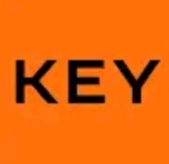

# SESAMELAB(참깨연구소)
- 회사 정보: https://www.sesame-lab.com/

## 저는 도전전문가입니다.
```
이전 회사(klnet)에서는 주로 자바와 JSP를 사용하여 웹개발을 진행했습니다. 그러나 지금의 회사(sesamelab)에서는 완전히 다른 환경과 기술을 사용하고 있었습니다. C#이 주 언어로 사용되며, AWS와 Docker와 같은 비교적 신기술들을 활용하고 있었습니다.

회사 내에는 백엔드 개발자가 저를 포함하여 3명뿐이었으며, 각자가 담당한 업무가 많다보니 자세한 인수인계와 도움을 받기란 어려운 상황이었습니다. 그러던 중 선임 개발자가 퇴사하며 메인 서비스의 유지보수까지 맡게 되었습니다.

가까스로 적응을 하고 있던 무렵, 회사에서는 블록체인 개발자가 없는 상황에서 블록체인을 도입하고자 했고, 기반지식이 없는 상태에서 도전을 시도했습니다. 이 무렵 우리팀은 C#을 벗어나 Node.js 기반의 프로그래밍을 시도하고 있기도 했습니다.

결국 성공적으로 서비스를 런칭하였고, 제가 메인서버를 담당하게 되었습니다. 동시에 AWS 인프라를 공부하면서 CodePipeline을 기반으로한 배포 시스템을 구축하기도 했습니다.

현재 시점에서는 맡은 서비스가 15개 이상이며, 지속적인 도전의 연속입니다. 언제나 도전에 즐거움을 느끼며 자신감이 넘치고 있습니다. 이런 새로운 도전을 통해 끊임없이 성장하고 있습니다.
```

## 서비스 운영 중 큰 장애를 해결해 본 경험이 있습니다.
```
키링 서비스 유지보수 중 로그 시스템을 새롭게 도입한 당일날, 충분한 모니터링을 마치고 퇴근했습니다. 회사는 신사동에 위치해 있었고 저는 가까운 강남에서 친구들과 시간을 보내고 있었습니다.

그러나 직원들로부터 앱에 문제가 있는지 물어보는 메시지를 받았습니다. 간담이 서늘해지며 바로 폰으로 모니터링을 했는데, 퇴근 후 어느 정도 시간이 지난 뒤에 서버 트래픽이 급격히 증가하면서 CPU 사용률이 100%로 치솟고 서버가 다운되었습니다. 다행인건지 서버가 재시작을 하며 간간이 동작을 시키고는 있었습니다. 

장애가 지속된지 어느 덧 30분이 지난 시점이었고, 즉시 약속장소를 뛰쳐나와 회사로 복귀했습니다. 다행히 원인을 빠르게 파악했고 서버를 정상화시켰습니다. 로그 시스템에서 테스트하지 못한 부분에서 정합성 문제가 발생하였고, 이로 인해 서버가 지속적으로 재시도하면서 문제가 발생한 것이었습니다.

다 수습이 되고 나서야 든 생각은, 서버에 문제가 생겼을 시 받아볼 수 있는 경고알림의 구축이 시급하다는 것이었습니다. 그 결과, AWS 내 cloudwatch 솔루션과 연동하여 이메일을 통해 경보를 받아볼 수 있는 시스템을 구축했습니다. 이후 어디서든 경보를 받게되면 팀원들과 소통하며 즉각적인 대처를 할 수 있는 체계가 갖추어졌습니다.
```

## 프로젝트
### 엘리베이터 로컬 에이전트
- 분류: ``실무``
- 소개: TK, 현대, OTIS 등의 CRT 모니터 서버와 통신할 수 있는 로컬 에이전트 서버
- 구성원: 2명
- 기간: 2023.05 ~ 2023.07
- 역할
  - OTIS_EMS 모니터 서버에 커맨드를 주고 받는 에이전트 서버 개발 및 유지보수
- 기술스택: C#, Dotnet Core, AWS(rds(mysql)) ...
<br/>

### Background worker
- 분류: ``실무``
- 소개: Keyring 앱 통계를 위해 만든 프로세스
- 구성원: 1명
- 기간: 2023.01 ~ 2023.07
- 역할
  - 생성된 유저 / 단지 / 발급된 키를 통계내는 배치 프로그램 개발 및 유지보수
  - 키 사용현황을 통계내는 배치 프로그램 개발 및 유지보수
- 기술스택: Nodejs, typescript, nextjs, mongoDB, docker, linux, AWS(ec2, vpc, rds(mysql)) ...
<br/>

### Backoffice
- 분류: ``실무``
- 소개: Keyring 등 사내 서비스 사용 및 관리의 편의를 위한 툴
- 구성원: 1명
- 기간: 2022.04 ~ 2023.07
- 역할
  - keyring notice 관리 시스템 풀스택 개발 및 유지보수
  - keyring pushnotification 관리 시스템 풀스택 개발 및 유지보수
  - 파일 업로드 시스템 풀스택 개발 및 유지보수
- 기술스택: typescript, nextjs, mongoDB, vercel, linux, AWS(s3, beanstalk, ECS, ECR, codepipeline ...), FCM ...
<br/>

### [](https://play.google.com/store/apps/details?id=com.keywe.keyring) [Keyring](https://www.keyring.life/)
- 분류: ``실무``
- 소개: 블록체인을 적용한 공동현관 키 통합 플랫폼
- 구성원: 2명(백엔드 한정)
- 기간: 2021.08 ~ 2023.07
- 역할
  - 배포시스템 구축(codepipeline 기반 / github action 기반)
  - 앱 API 및 블록체인 릴레이 기능의 서버 개발 및 유지보수
  - hyperledger fabric 환경 설정 및 구축 / 유지보수
  - hyperledger fabric chaincode 개발 및 유지보수
  - certification 서버 개발 및 유지보수
  - timer 서버 개발 및 유지보수
  - pushnotification 서버 개발 및 유지보수
- 기술스택: Nodejs, typescript, nextjs, mongoDB, docker, linux, AWS(ec2, vpc, rds(mysql), s3, beanstalk, ECS, ECR, codepipeline ...), FCM, Redis, hyperledger fabric ...
<br/>

### [](https://play.google.com/store/apps/details?id=com.keywe.keyring) Keyin
- 분류: ``실무``
- 소개: Raonark 도어락을 제어 및 관리하기 위해 만들어진 프로젝트
- 구성원: 1명(백엔드 한정)
- 기간: 2021.08 ~ 2022.01
- 역할
  - 도어락 CRUD, 파트너 관리, 도어락 제어 및 핀코드 변경등을 수행하는 앱 API 서버 개발 및 유지보수
    - docker 를 이용한 컨테이너, 로그 관리 및 배포
- 기술스택: C#, Dotnet Core, docker, linux, AWS(ec2, vpc, rds(mysql)), FCM, Redis ...
<br/>

### KeyweOn
- 분류: ``실무``
- 소개: 자체 생산한 도어벨을 제어 및 관리하기 위해 만들어진 프로젝트
- 구성원: 2명(백엔드 한정)
- 기간: 2021.06 ~ 2021.10
- 역할
  - 도어벨 제어서버 앞단에 위치하는 도어벨 CRUD, 파트너 관리 등을 수행하는 앱 API 서버 개발 및 유지보수
    - docker 를 이용한 컨테이너, 로그 관리 및 배포
- 기술스택: C#, Dotnet Core, docker, linux, AWS(ec2, vpc, rds(mysql)), FCM, Redis ...
<br/>

### Premo IoT
- 분류: ``실무``
- 소개: ZWave 프로토콜을 이용하는 도어락 및 허브 정보 / 파트너정보 / 핀코드 등을 관리하며, ZWave 장치들을 제어하기 위해 만들어진 프로젝트
- 구성원: 2명(백엔드 한정)
- 기간: 2021.04 ~ 2023.07
- 역할
  - 서버 모니터링 및 유지보수(mgrv, onda 등의 업체들의 개발cs 대응)
    - docker 를 이용한 컨테이너, 로그 관리 및 배포
    - 비동기로 구성된 API를 동기로 변환하는 작업 수행
- 기술스택: C#, Dotnet Core, docker, linux, AWS(ec2, vpc, rds(mysql)), Redis ...
<br/>